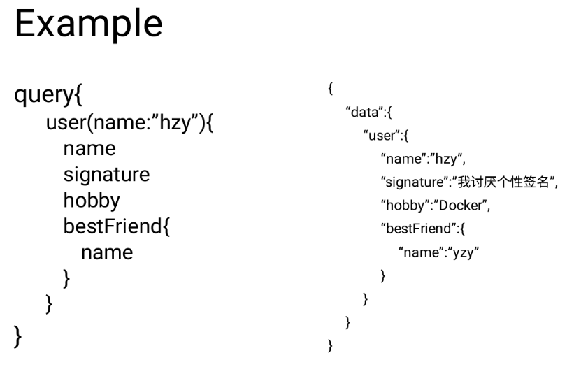
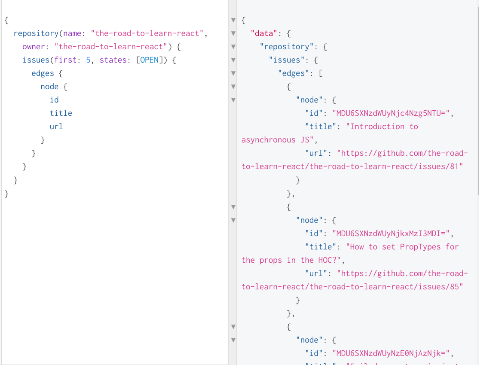
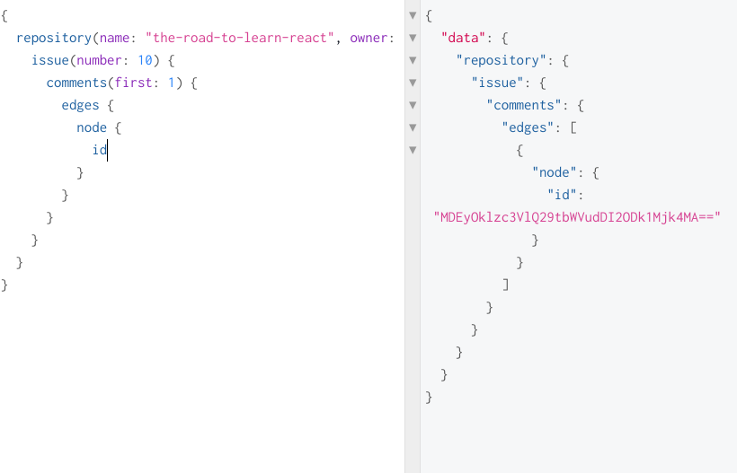
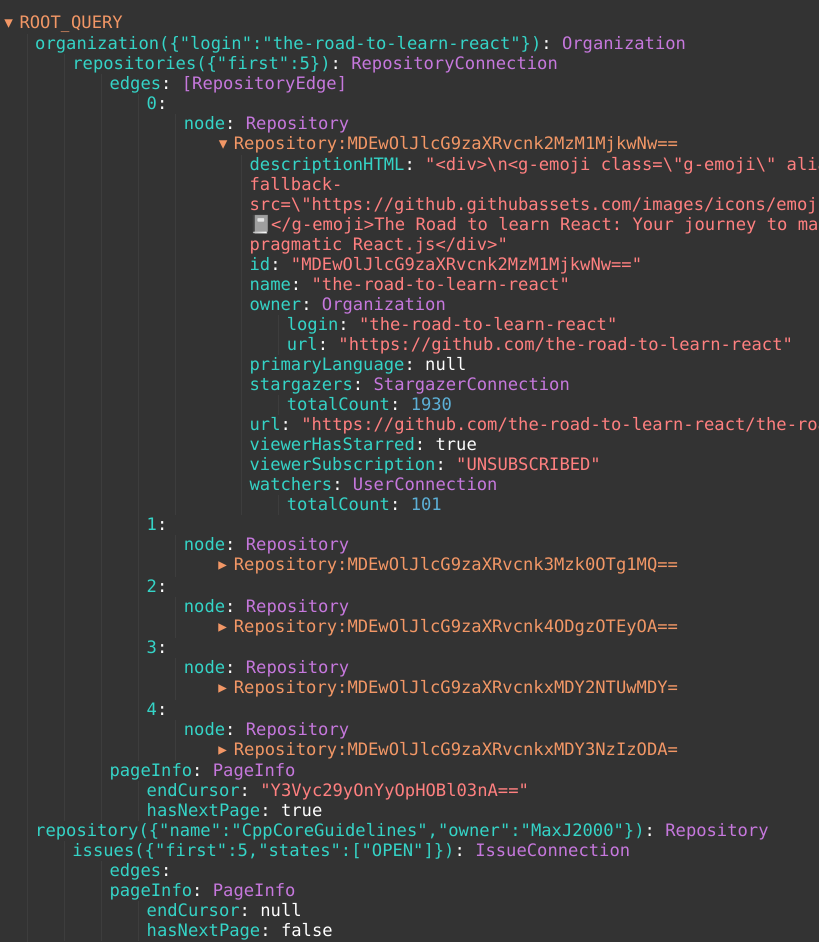
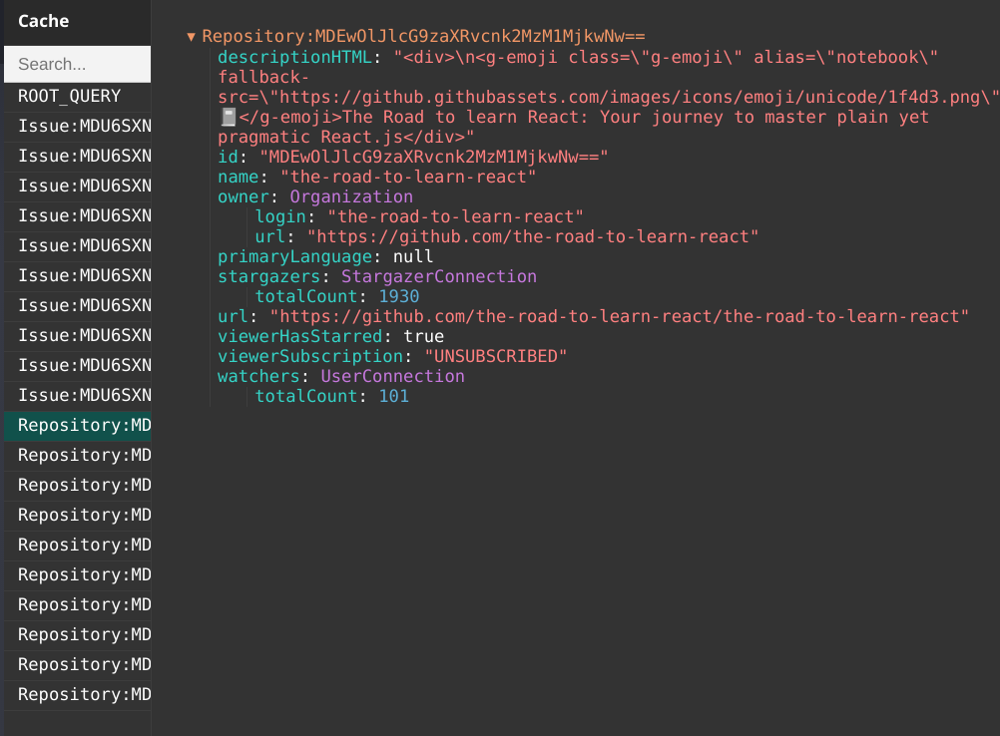

## 浅谈Apollo

### 前言：什么是GraphQL

对于前端来说，GraphQL是一个很好的减轻工作量的工具。

在规定的schema下，一次查询所需的所有的内容。



关于GraphQL的详情以及在后端的应用可以查看兔兔的《从GraphQL到Prisma》。

### 使用GraphQL与Github GQLAPI进行交互

1. 查询数据，接收返回值



对应的代码

```javascript
const GET_ORGANIZATION = `
  {
    organization(login: "the-road-to-learn-react") {
      name
      url
      ...
    }
  }
`;
const axiosGitHubGraphQL = axios.create({
  baseURL: 'https://api.github.com/graphql',
  ...
});

```

2. 处理数据，修改状态

```javascript
class App extends Component {
     state = {
       organization: null,
       errors: null,
     };
     ...
     onFetchFromGitHub = () => {
       axiosGitHubGraphQL
         .post('', { query: GET_ORGANIZATION })
         .then(result =>
           this.setState(() => ({
             organization: result.data.data.organization,
             errors: result.data.errors,
           })),
         );
     }
     ...
   }   
```

Or use Redux

```javascript
function* handleFetch() { //use redux-saga
  const res = yield call(axiosGitHubGraphQL.post, '', 
                         { query: GET_ORGANIZATION })
  yield put(action("FETCH_SUCCESS", data))
}
const reducer(state, action) => {
  switch (action.type) {
    case "FETCH_REQUEST": {
      return { ...state, loading: true }
    }
    case "FETCH_SUCCESS": {
      return { ...state, loading: false, data: action.payload }
     ...
  }
}
```

3. 从state中读取数据，施工我们的视图层

4. 一些恼人的细节

   1. state高度嵌套，查询麻烦

      

   2. 缓存信息需要重复搬砖

   3. 不能抛开视图层专注处理数据

   4. 本地UI进行积极更新

      

### Apollo一把梭

#### Apollo帮我们做了什么

1. 缓存数据，提升性能
2. normalize

From



To



3. 较为便捷的实现积极UI

#### 代码实现

1. Apollo-Link 

```javascript
import { ApolloClient } from 'apollo-client';
import { HttpLink } from 'apollo-link-http';
import { InMemoryCache } from 'apollo-cache-inmemory';

const httpLink = new HttpLink({
  uri: https://api.github.com/graphql
});
const cache = new InMemoryCache();
const client = new ApolloClient({
  link: httpLink,
  cache,
});
```

2. Apollo-react

```javascript
import { ApolloProvider } from 'react-apollo';

ReactDOM.render(
  <ApolloProvider client={client}>
    <App />
  </ApolloProvider>,
  document.getElementById('root')
);
```

3. Query

```javascript
import gql from 'graphql-tag';
import { Query } from 'react-apollo';

const GET_CURRENT_USER = gql`
  {
    viewer {
      login
      name
    }
  }
`;

const Profile = () => (
  <Query query={GET_CURRENT_USER}>
    {({ data }) => {
      const { viewer } = data;
      return (
        <div>
          {viewer.name} {viewer.login}
        </div>
      );
    }}
  </Query>
);
```

4. Mutation

```javascript
import { Mutation } from 'react-apollo';

const STAR_REPOSITORY = gql`
  mutation($id: ID!) {
    addStar(input: { starrableId: $id }) {
      starrable {
        id
        viewerHasStarred
      }
    }
  }
`;

<Mutation mutation={STAR_REPOSITORY} variables={{ id }}>
          {(addStar) => (
            <Button
              className={'RepositoryItem-title-action'}
              onClick={addStar}
            >
              {stargazers.totalCount} Star
            </Button>
          )}
</Mutation>
```

5. Local State

```javascript
const updateAddStar = (client, mutationResult) => {
  ...
};

<Mutation mutation={STAR_REPOSITORY} variables={{ id }} 
          update={updateAddStar}>
            ...
</Mutation>
```

实际上的updateAddStar

```javascript
const REPOSITORY_FRAGMENT = gql`
  fragment repository on Repository {
    id
    viewerHasStarred
    stargazers {
      totalCount
    }
  }
`;

const updateAddStar = (
  client,
  { data: { addStar: { starrable: { id } } } },
) => {
  const repository = client.readFragment({
    id: `Repository:${id}`,
    fragment: REPOSITORY_FRAGMENT,
  });
  const totalCount = repository.stargazers.totalCount + 1;
  client.writeFragment({
    id: `Repository:${id}`,
    fragment: REPOSITORY_FRAGMENT,
    data: {
      ...repository,
      stargazers: {
        ...repository.stargazers,
        totalCount,
      },
    },
  });
};
```

6. Optimistic UI

```javascript
<Mutation mutation={STAR_REPOSITORY} variables={{ id }}  update={updateAddStar} 
	optimisticResponse={{
       updateSubscription: {
           __typename: 'Mutation',
           subscribable: {
             __typename: 'Repository',
             id,
             viewerHasStarred: !viewerHasStarred,
          },
       },
}}>
    {(addStar, { data, loading, error }) => (
              <Button
                className={'RepositoryItem-title-action'}
                onClick={addStar}
              >
                {stargazers.totalCount} Star
              </Button>
            )}
</Mutation>
```